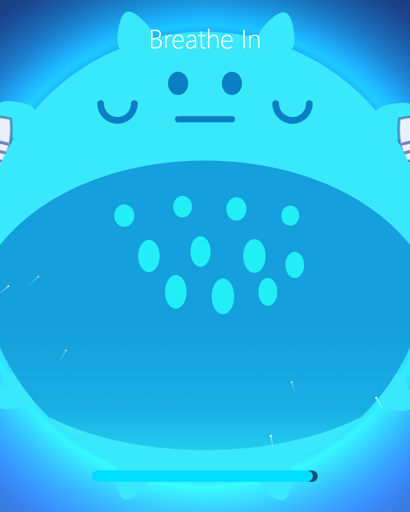

# Breathe — Pufferfish

A breathing-exercise web app for children. An animated pufferfish inflates and
deflates to guide slow, deep breaths.

<p align="center">
  
</p>

## Quick start

```bash
npm install
npm run dev          # http://localhost:5173
```

URL params: `?cycle=8` (seconds per breath) `?duration=60` (session length).

## More

- Architecture, file map, asset notes → [AGENTS.md](AGENTS.md)
- Cloud / Codespaces setup, Playwright, Pages deploy → [CLAUDE.md](CLAUDE.md)
- Architectural decisions → [DECISIONS.md](DECISIONS.md)

## Regenerating the preview image

```bash
npm run dev &        # in another shell
node scripts/capture-preview.mjs   # writes public/preview.png
```
